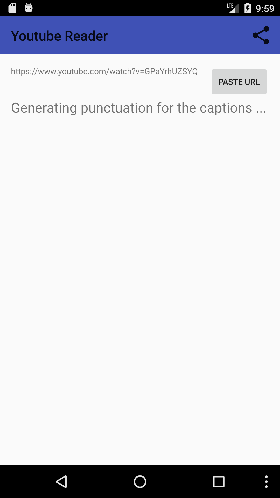
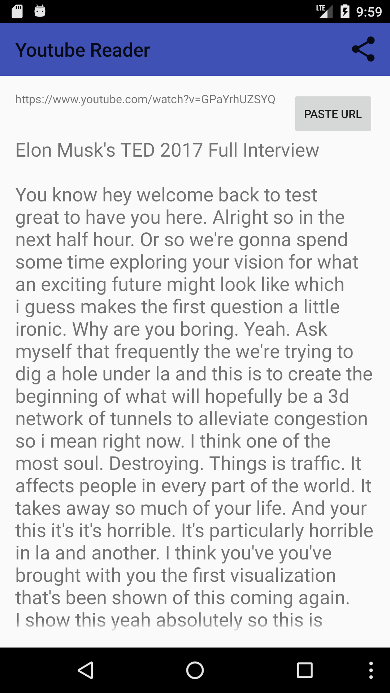

# Youtube Reader For Android

Save mobile data watching Youtube: Download and read only captions!

## Download

- Not available on Google Play, because it uses Google's Youtube without showing ads.
- Soon on F-Droid store!
- Direct APK link: [store/youtube-reader-release.apk](https://github.com/vackosar/youtube-reader/blob/master/store/youtube-reader-release.apk?raw=true)

## Donate

* 
* [Bitcoin: 1NapZs8brWNifGk7QFemqTByczdBAAg9cA](bitcoin://1NapZs8brWNifGk7QFemqTByczdBAAg9cA)

## Description:

Would you like to ...
- know what's said in the video without having to spend valuable mobile data?
- quickly skim through videos text?
- backup the video captions and read them later?

Then this app is for you!

This app downloads captions using Youtube URL and displays them automatically punctuated.
You can also easily listen to the text using your favourite text to speech.

Note that not all videos provide captions and app is in current version limited to English only.

## Screenshots

## Technology

Uses neural network to punctuate captions. Neural network is executed on Android using Tensorflow for Android libraries.
Keras training project with a command line utility can be found here: https://github.com/vackosar/keras-punctuator

# Subscribe to My Blog

[VaclavKosar.com](https://vaclavkosar.com)
